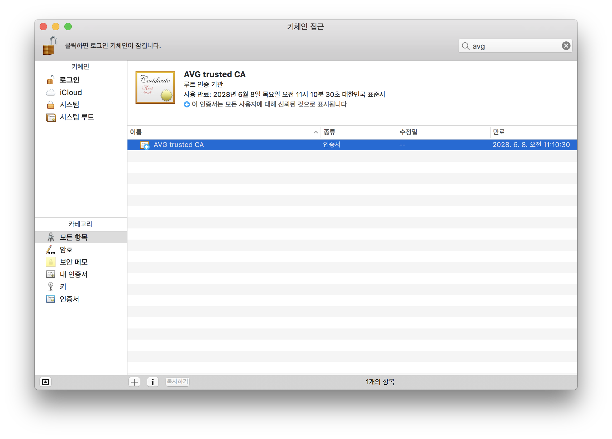
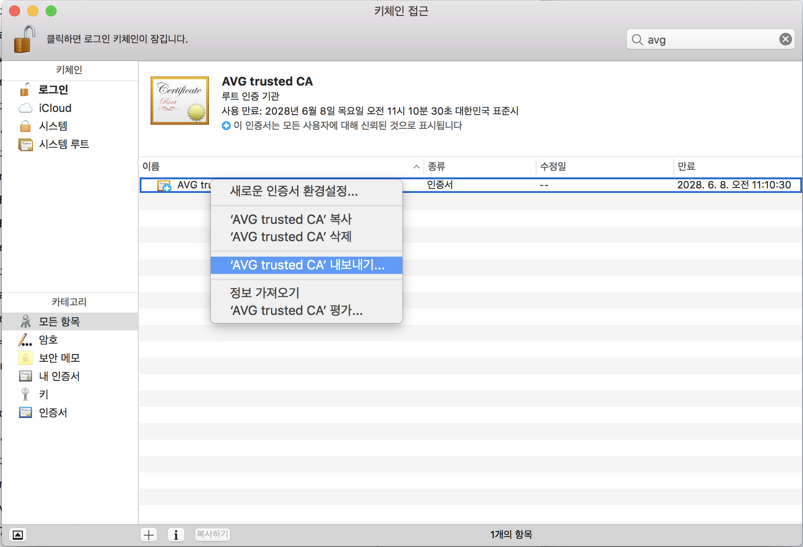
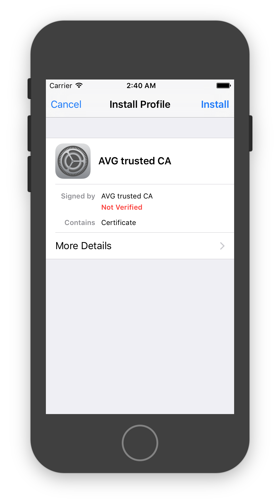
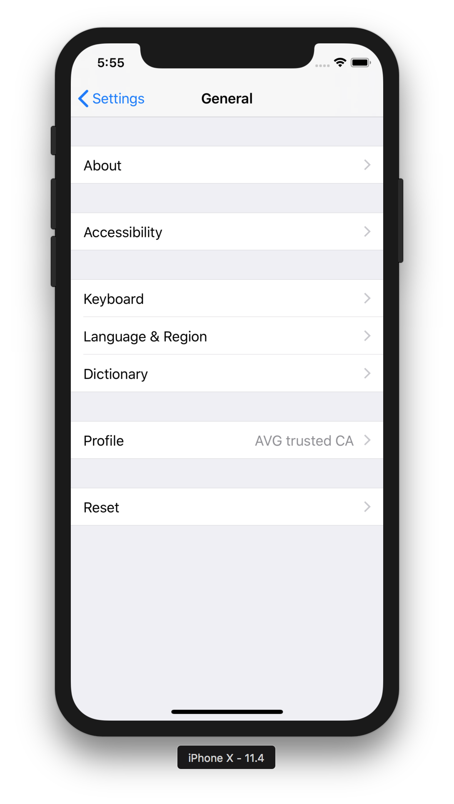
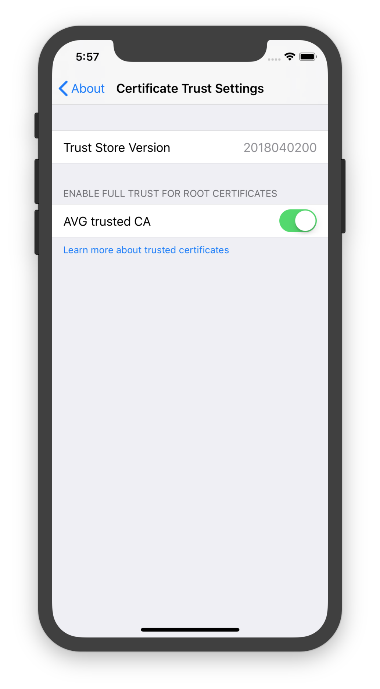

시뮬레이터 웹뷰에서 아래와 같은 에러가 날 때가 있다.
시뮬레이터의 키체인에 해당 사이트의 인증서 CA가 없어서 사이트를 신뢰하지 못해 발생하는 에러다.
```
Error Domain=NSURLErrorDomain Code=-1202 "The certificate for this server is invalid. You might be connecting to a server that is pretending to be “www.yourdomain.kr” which could put your confidential information at risk." UserInfo={NSUnderlyingError=0x7fa53ee22f80 {Error Domain=kCFErrorDomainCFNetwork Code=-1202 "The certificate for this server is invalid. You might be connecting to a server that is pretending to be “www.yourdomain.kr” which could put your confidential information at risk." UserInfo={_kCFStreamErrorDomainKey=3, NSLocalizedRecoverySuggestion=Would you like to connect to the server anyway?, _kCFNetworkCFStreamSSLErrorOriginalValue=-9813, _kCFStreamPropertySSLClientCertificateState=0, NSLocalizedDescription=The certificate for this server is invalid. You might be connecting to a server that is pretending to be “www.yourdomain.kr” which could put your confidential information at risk., NSErrorFailingURLKey=https://www.yourdomain.kr/, NSErrorFailingURLStringKey=https://www.yourdomain.kr/, _kCFStreamErrorCodeKey=-9813}}, NSLocalizedRecoverySuggestion=Would you like to connect to the server anyway?, NSErrorPeerCertificateChainKey=<CFArray 0x7fa53ec09b80 [0x114237a40]>{type = mutable-small, count = 1, values = (
0 : <cert(0x7fa53ee21f50) s: *.yourdomain.kr i: AVG trusted CA>
)}, NSLocalizedDescription=The certificate for this server is invalid. You might be connecting to a server that is pretending to be “www.yourdomain.kr” which could put your confidential information at risk., _WKRecoveryAttempterErrorKey=<WKReloadFrameErrorRecoveryAttempter: 0x7fa53ee0fcc0>, NSErrorFailingURLKey=https://www.yourdomain.kr/, NSErrorClientCertificateStateKey=0, NSErrorFailingURLStringKey=https://www.yourdomain.kr/}
```

1. 에러메시지 중간에 있는 정보를 통해 어떤 인증서가 없는지 확인한다.
```
0 : <cert(0x7fa53ee21f50) s: *.yourdomain.kr i: AVG trusted CA>
```

2. 맥의 '키체인 접근'에 들어가서 AVG의 CA인증서를 받자.


3. 오른쪽 버튼을 눌러 내보내기를 선택하고 cer 파일로 저장한다.


4. cer 파일을 드래그해서 시뮬레이터에 올리면 설치화면이 뜬다.


인스톨하고 다시 앱을 실행해보면 SSL에러가 더이상 발생하지 않는다.

## iPhone X
iPhone X의 시뮬레이터에서 위의 방법이 동작하지 않았다. 동일하게 드래그해서 넣으면
프로파일에 추가된다.

`Settings -> General -> About -> Certificate Trust Settings`에 들어가면 해당 인증서의 full trust 를 활성화할 수 있다.

