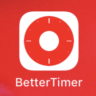

## 서문
생각보다 빠르게 2월이 왔다가 빠르게 갔다. 이번달엔 어떻게 살았나 생각해보니, 딱히 이룬게 떠오르지 않고 정신없이 지나간 것 같다.  
이 달은 다른 달보다 조금 짧기도 하고 설 연휴도 있어서 그렇다고 합리화를 해보지만, 그래도 아쉬움이 남는 달이다.

## 더나은타이머

와디즈 스터디 모임 와다닥에서 이야기를 나누다가 타이머앱을 만들어 달라는 주문이 들어왔다.  
타이머 같은거야 아이폰 기본기능으로 있고, 앱스토어 들어가봐도 뽀모도로부터 해서 완전 널려 있는거 아닌가.  
그런데 또 생각해보니 쏙 맘에 드는 앱은 딱히 없는 것 같기도 해서 공부삼아 한번 만들어보겠다고 약속을 했다.  
그렇게 더나은 시리즈의 두번째 앱 '더나은 타이머'가 시작되었다.  

현업에서 CoreGraphics와 CoreAnimation을 쓸 일이 거의 없었는데, 이번 사이드 프로젝트에선 이걸 한번 도전해 봐야겠다.
역시나 사이드로 하다보니 개발속도가 쭉쭉 나오고 있지는 않다.  
그래도 이런거 만들겠다고 깃허브에 레포 따고 공유부터 했더니, 어찌어찌 하게 된다. 선언의 효과가 다시한번 느껴진다.

## 영어공부 시작
새해마다 하는 약속중에 영어공부는 꼭 들어간다.  
작년부터 생각하는 거지만, 어떤 목표를 이루고자 할때 두가지를 고려한다.

1. 완성된 미래를 너무 멀리 내다보지 말고, 가까이의 작은 목표를 세운다.
2. 마음만 먹지 않고, 시작점이 되는 어떤 액션을 꼭 한다.

그래서 야나두를 등록했다. 야나두와 시원스쿨을 놓고 고민을 좀 하긴 했는데, 최종적으로 야나두를 선택했다.  
와이프도 그전까지는 영어를 그렇게 중요하게 생각하지 않았었는데, 업무상 영어가 필요한 상황이 되니 매우 열심이다.  
나도 꾸준히 듣고 열심히 해보려고 한다.

## 책

스위프트 4 프로토콜 지향 프로그래밍

## 링크

스위프트 초급자를 위한 팁 모음  
[https://github.com/Fried-Chicken/things-I-wish-I-knew-as-a-swift-beginner](https://github.com/Fried-Chicken/things-I-wish-I-knew-as-a-swift-beginner)

일상적인 iOS 개발 태스크를 자동화하는 법  
[https://academy.realm.io/kr/posts/felix-krause-fastlane-automating-ios-tasks/](https://academy.realm.io/kr/posts/felix-krause-fastlane-automating-ios-tasks/)

콘웨이의 법칙  
[https://subokim.wordpress.com/2017/09/05/conways-law/](https://subokim.wordpress.com/2017/09/05/conways-law/)

아이패드로 맥에 원격 접속하여 (프론트엔드) 개발하기  
[https://adhrinae.github.io/posts/how-to-remotely-connect-with-your-mac-using-ipad](https://adhrinae.github.io/posts/how-to-remotely-connect-with-your-mac-using-ipad)

삶에서 항상 붙들고 있어야 하는 세 가지 질문  
[https://ppss.kr/archives/183110](https://ppss.kr/archives/183110)

프로그래머스 설문조사 결과  
[https://programmers.co.kr/pages/dev-survey-2019](https://programmers.co.kr/pages/dev-survey-2019)

글쓰기는 개발자에게 굉장한 힘이 된다.  
[https://www.imaso.co.kr/archives/3596](https://www.imaso.co.kr/archives/3596)

MVVM 아키텍쳐 패턴  
[https://justhackem.wordpress.com/2017/03/05/mvvm-architectural-pattern/](https://justhackem.wordpress.com/2017/03/05/mvvm-architectural-pattern/)

리액트스럽게 생각하기  
[https://velog.io/@odini/Thinking-in-React리엑트스럽게-생각하기](https://velog.io/@odini/Thinking-in-React%EB%A6%AC%EC%97%91%ED%8A%B8%EC%8A%A4%EB%9F%BD%EA%B2%8C-%EC%83%9D%EA%B0%81%ED%95%98%EA%B8%B0)

1만2500시간의 '의도적 휴식'  
[http://www.hankyung.com/news/amp/2018051381961](http://www.hankyung.com/news/amp/2018051381961)

Hello React Hooks  
[https://ahnheejong.name/articles/hello-react-hooks/](https://ahnheejong.name/articles/hello-react-hooks/)

Swift 5.0 변경사항  
[https://zeddios.tistory.com/680](https://zeddios.tistory.com/680)

What's new in swift 5.0  
[https://www.hackingwithswift.com/articles/126/whats-new-in-swift-5-0](https://www.hackingwithswift.com/articles/126/whats-new-in-swift-5-0)

현명한 소비를 하고 싶다면 「하루 중 오랜 시간 사용하는 물건」에 돈을 써라  
[http://isao76.egloos.com/m/2537311](http://isao76.egloos.com/m/2537311)

글쓰기 가이드는 어떻게 써야할까 - 배달의 민족 글쓰기 가이드 제작 후기  
[https://brunch.co.kr/@cardnews/17?fbclid=IwAR0xbPwqqrEMhZpuXTU3MeWOptUx2ma_rdtpcW8gziRWgZWCoXIObKrIV3U](https://brunch.co.kr/@cardnews/17?fbclid=IwAR0xbPwqqrEMhZpuXTU3MeWOptUx2ma_rdtpcW8gziRWgZWCoXIObKrIV3U)

구글, 사이트 신뢰성 엔지니어링 워크북 온라인 무료 공개  
[https://www.44bits.io/ko/post/news--google-open-site-reliability-workbook](https://www.44bits.io/ko/post/news--google-open-site-reliability-workbook)

Git 사용 중 자주 만나는 이슈 정리  
[https://parksb.github.io/article/28.html](https://parksb.github.io/article/28.html)

[Network] REST란? REST API란? RESTful이란?  
[https://gmlwjd9405.github.io/2018/09/21/rest-and-restful.html](https://gmlwjd9405.github.io/2018/09/21/rest-and-restful.html)

3개월 차 주니어가 느끼는 나와 시니어의 차이  
[https://zeniuus.github.io/2019/02/06/difference-between-junior-and-senior/](https://zeniuus.github.io/2019/02/06/difference-between-junior-and-senior/)

스터디파이는 왜 이 일을 하는가  
[https://brunch.co.kr/@taewookim/12](https://brunch.co.kr/@taewookim/12)

## 영상

[테드강연] 우리가 쓸데없는 것을 만들어야 하는 이유 - 시몬 예츠  
[https://www.youtube.com/watch?v=GfAyTJVufDg](https://www.youtube.com/watch?v=GfAyTJVufDg)

더 나은 개발자로 성장하는 팁 "스터디는 왜? 어떻게 하는 거야?" - 백기선  
[https://www.youtube.com/watch?v=bx29lcIXCPg](https://www.youtube.com/watch?v=bx29lcIXCPg)

아름다운 것들은 왜 우리를 행복하게 만드는가 – 아름다움에 대한 설명(Why Beautiful Things Make us Happy – Beauty Explained)  
[https://www.youtube.com/watch?v=-O5kNPlUV7w](https://www.youtube.com/watch?v=-O5kNPlUV7w)
