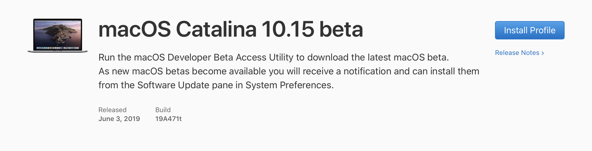
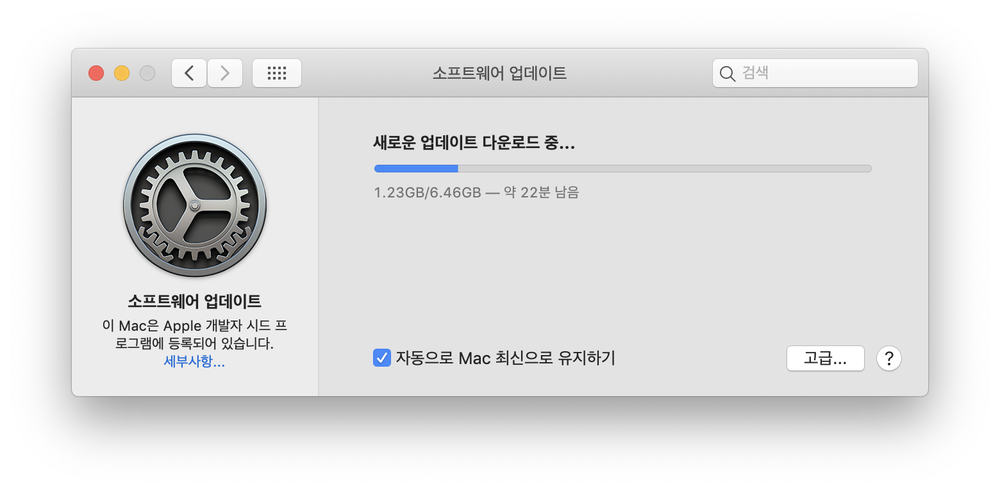
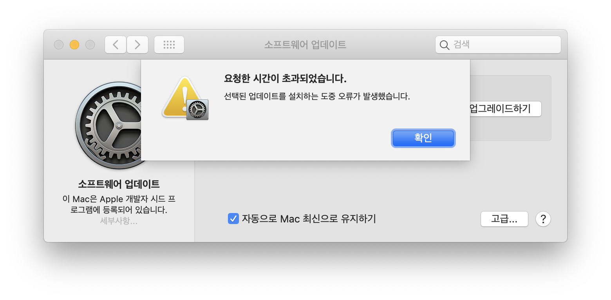
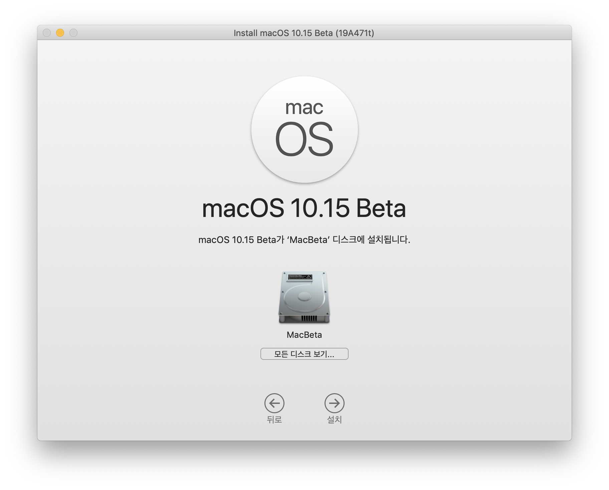
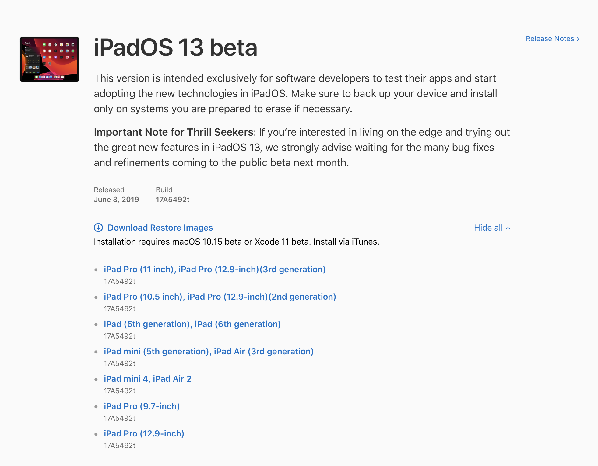
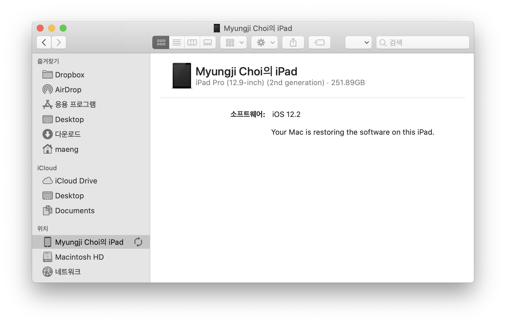
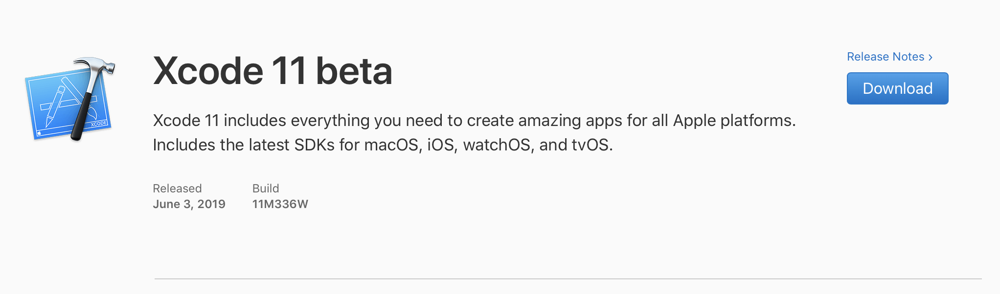

## macOS Catalina 설치
새 macOS 카탈리나를 설치해보자.
메인 OS를 베타로 쓰긴 좀 그러니 파티션을 하나 나눠서 거기에 설치해보자.

1. [developer.apple.com](http://developer.apple.com) 에 접속해서 Install Profile 설치

베타를 설치하는 프로그램을 설치한다.

이 Mac이 Apple 개발자 시드 프로그램에 등록되어 있다는걸 보니, 이전에 베타를 설치했던 기억이 있어서 그런가보다. 처음 설치를 하는 사용자는 다른 과정을 거칠지도 모르겠다.

2.1기가쯤 딱 어느 위치에서 계속 다운로드가 멈춘다. 사무실이었는데, 결국은 집에 와서 다른 네트워크에서 다시 해서 다운로드에 성공했다.

macOS의 설치프로그램의 설치프로그램 macOSDeveloperBetaAccessUtility는 현재의 파티션에밖에 설치가 안된다.
macOS Catalina 베타가 현재 파티션에 설치되는건가 하고 겁나서, 새 파티션에 mojave를 먼저 깔고 베타 업그레이드를 했다.
막상 실제로 OS를 설치할땐 빈 파티션을 고를수 있으니, 쓸데없는 삽질을 한셈.

## iPadOS 설치

자 그담엔 아이패드에도 베타를 깔아보자.
iOS베타를 설치할 때 예전에는 ipsw 라는 파일을 받아 이미지 설치를 했었는데, 언제부턴가 방식이 바뀐것 같다.
최근 언젠가부턴 profile을 받으면 OTA로 업데이트가 뜨는 식으로 되는 것 같다.
그러나 이번 설치땐 다시 ipsw 파일이 제공되어 itunes를 통해 초기화하는 방식으로 설치한다.

macOS Catalina 에는 itunes가 없어지고 music, tv, podcast 등으로 쪼개졌다. 연결된 아이폰과 아이패드는 파인더의 사이드 메뉴에서 찾을 수 있다.

## Xcode 11 베타 설치

Xcode 설치는 뭐 별 어려움이 없다.

준비완료. 이제 SwiftUI를 써볼까!
