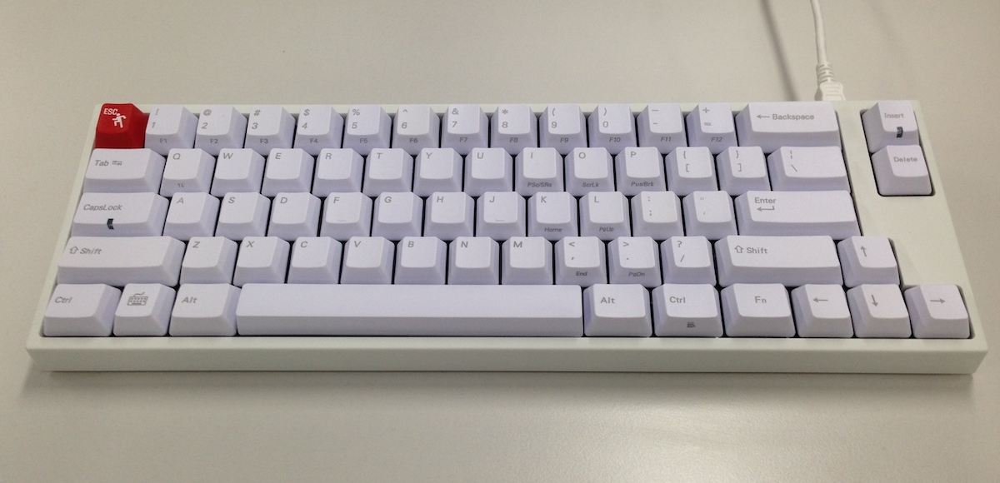
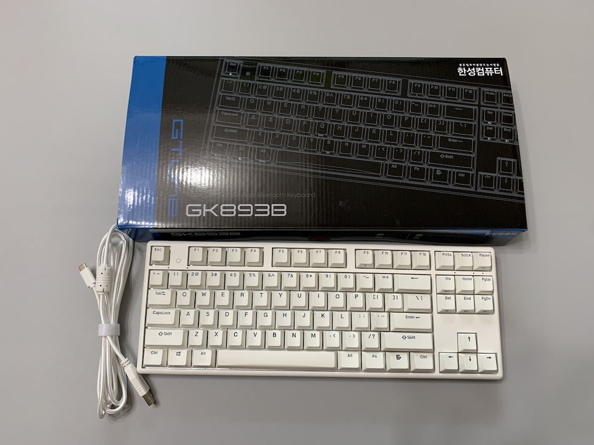

## 서론
시간은 어떻게 이렇게 빠르게 가는지, 한달이 금세 흘렀다.  
새 회사에서도 이제 세달정도 되었고, 달라진 환경에도 점점 적응을 해 나가고 있다.
아무래도 출퇴근이 먼 것은 제일 적응하기가 힘든데, 그래도 긴 출퇴근 시간을 잘 활용하기 위해 노력을 하고 있다.

## 블로그 개편
블로그를 GatsbyJS로 개편했다.

모바일앱 개발자로서 리액트 네이티브는 한번 경험해 봐야지 생각을 하고 있는데, 당장에 리액트를 사용할 계기를 만들어 보자 하고 정적사이트 라이브러리를 GatsbyJS를 써보자고 마음 먹었다.
 Jekyll도 많은 사람들이 쓰고 있는 좋은 도구이지만, 루비라는 언어가 나에겐 뭔가 좀 귀찮다. 안그래도 사용하는 언어가 너무 많아 헷갈리는데…

그리고 레이아웃도 좀 예쁘게 다듬을 겸 해서 개편을 시작했다.

아직 설정이 완전히 된 것은 아니지만, 조금씩 고쳐나가고 조금씩 나아지는 과정이 재미있고 즐겁다

글을 쓰는 방식도 좀 바꿔볼까 싶다. 블로그란게 원래 포스팅과 구독에 기반한 것이지만, 요샌 RSS도 예전같지않고 구독에 대해 고민할만한 규모도 아니다 좀더 짧고 쉽게 작성하고 자주 수정하거나 내용을 추가하면서 참조의 목적으로 써보려고 한다. 어쩌면 이건 위키와 같은 느낌이 될지도 모르겠다

## 해피해킹
결국에 해피해킹을 샀다.
맥북에 달려있는 키보드가 너무 불편하다. 생각하지 않고 쓸땐 괜찮았는데, 불편하다고 의식을 하고 나니까 갑자기 확 불편해졌다. 오타도 잘나고 타수도 잘 안나오는 것 같다

외장키보드를 사기로 마음을 먹고, 새 키보드의 몇가지 조건을 달았다
1. 무접점 아닌 기계식으로
2. 화이트
3. 블루투스
4. 기능키가 있을 것

이 네가지를 만족하는 모델을 결국은 찾지 못하였다.
그 전에 쓰던 레오폴드 660m, esc버튼에만 빨간색 커스텀 키캡을 넣었는데 나름 예쁘다
유선이고 기능키가 없다.

결국 한성에서 무접점 블루투스 키보드를 샀다

원래는 기계식의 키감을 선호했지만, 주변에 한성키보드를 쓰는 사람이 좀 있어서 타건을 해보니 생각보다 괜찮았다. 무접점도 뭐 적응하면 나쁘지 않겠구나 싶어서 구입.

그러나 막상 써보니 애매하게 불편한 지점들이 있었다. 블루투스는 한번씩 끊어져서 쓸만한 수준이 되지 않는 것 같아 거의 선을 물려놓고 썼다. 색상도 화이트인줄 알았는데 아주 연한 아이보리+회색이라 화이트라 하기 어려운 그냥 플라스틱 색깔.

결국 13만원주고 산 키보드는 당근마켓에서 새 주인을 찾았다.

고민되었다. 애매한 키보드를 십몇만원주고 실망하고를 반복하지 말자. 이럴바엔 바로 끝판왕으로 가야지.
그래서 고심끝에 해피해킹을 질렀다.

처음에 생각한 조건은 블루투스만 빼고 다 깨졌다.
검은색에 무접점이다. 기능키는 커녕 방향키도 없다. 캡스락도 없고, 백스페이스는 또 왜 여기붙어 있는거야.
대신에 모든걸 다 용서하게 만드는 키감. 정말 이런 키감때문에 끝판왕 소릴 듣는구나.
손에 착 붙으면서도 가볍다. 조용하면서도 구분감이 딱 있다.
이제 어떤 글도 쓸수 있을것 같고 코딩도 더 잘될것 같다

## MDM 개발
회사에서 MDM개발을 시작했다.
사용자 기기의 특정 기능을 통제하는 기술조사 지시를 받았다.
이건 간단히 진행하기 어렵고, Apple MDM의 영역이라 어려울 것 같다는 답변을 했는데 결국 MDM을 해보게 되었다.

애플 엔터프라이즈 개발자 프로그램은 직원 100명이상의 회사가 직원용 배포를 필요로 할때 가입할 수 있는 라이선스지만, MDM개발을 목적으로 할땐. 100명 제한을 두지 않는다는 것을 알게 되었다.

좋은 기회가 될것 같다. 개인이 공부해서 할 수 있는 영역이 아니다 보니 더 잘 배워보고 싶다. 여기 아니면 언제 해보겠어.

## 신규서비스의 시작
신규서비스도 하나 들어가게 되었다.
아직은 구체적으로 얘기하긴 어렵지만, 방문예약 서비스다.

어느 회사에 가도 하고 싶은 일과, 하기 싫은데 해야만 하는 일, 나의 일이 아닌데도 나에게 떨어지는 일들 다 있겠지.
근데 이건 재미있을 것 같기도 하고, 회사에도 큰 기회가 되는 일이 될 것 같다.
내가 우리 회사에 돈을 벌어다 줄 수 있는 좋은 기회다. 오랜만에 신나게 한번 개발해볼까
