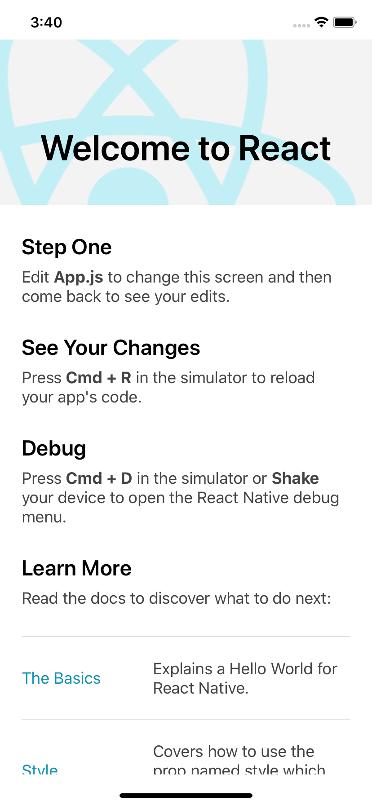

리액트 네이티브 앱을 설치해보자

## 설치
```
> npx react-native init NewReactNativeApp
```

## 실행
### iOS
```
> cd ~/workspace/NewReactNativeApp
> npx react-native run-ios
```

### android
```
> cd ~/workspace/NewReactNativeApp
> npx react-native run-android
```


## 구조
```
/android
안드로이드 프로젝트

/ios
iOS 프로젝트

/node_modules
react-native가 설치한 nods.js 모듈

App.js
코드에 위 실행화면에서 본 텍스트들이 들어있는걸 봐선 메인화면인가보다.

index.js
앱진입점인듯
```
