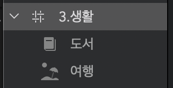
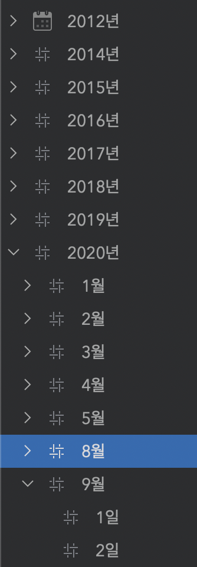
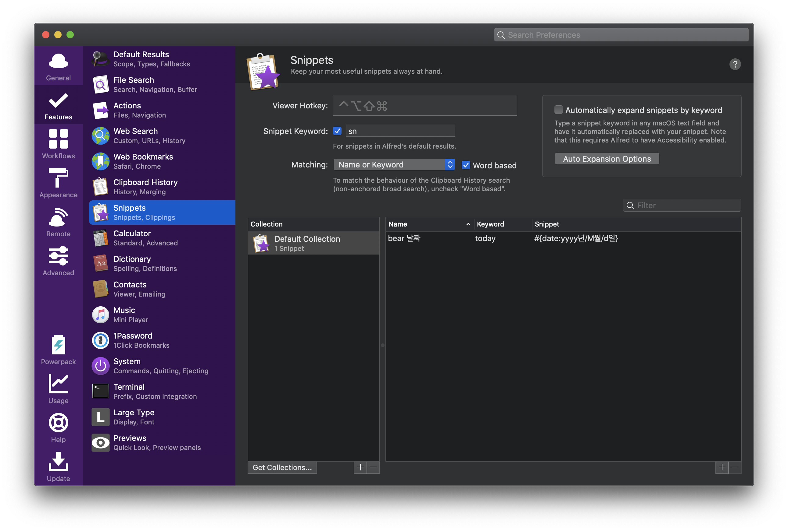

### Bear앱의 해시태그
베어앱의 해시태그는 다른 툴의 해시태그와 달리 계층형을 지원한다.
이를테면 이런 식이다.

```
#3.생활/도서
#3.생활/여행
```
등의 태그를 달면
왼쪽 태그영역에 아래 그림과 같이 계층구조로 표현된다.title



### 날짜별로 활용하기
모든 노트에 날짜를 다음과 같이 기록해보자.
```
#2020년/9월/2일
```
그러면 모든 기록물이 날짜별로 차곡차곡 쌓이는데다가, 년도별, 월별 카테고리화까지 가능하다.



### 스니펫 작성
이를 모든 노트에 직접 입력하는 것은 귀찮은 일이다.
알프레드앱의 스니펫 기능을 이용해보자.


스니펫은 일반문자열 스니펫과 속성문자열 스니펫을 선택할 수 있는데, 
일반문자열로 선택하면 된다.

스니펫은 날짜, 시간, 클립보드와 같은 요소들을 가져다 쓸수 있는 플레이스홀더를 제공하는데 우리가 사용할 날짜는 
`{date}`이며 뒤에 `:`을 붙여 그 형식을 자유롭게 지정할 수 있다.

```
#{date:yyyy년/M월/d일}
```

위와 같이 작성하면 알프레드 단축키만으로 오늘 날짜 해시태그를 바로 입력할 수 있다.
